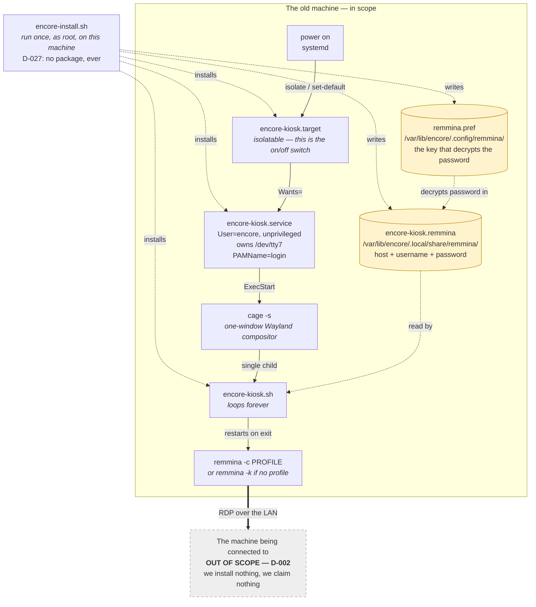

# The system in one page

The product turns an old Linux machine into a terminal that shows nothing but
a remote desktop session. It does this by **adding a boot target** to a machine
that already boots, not by replacing anything.

Everything is built out of parts already present on **any systemd-and-Wayland
Linux**. The product writes a small, named set of files onto the machine and
owns nothing else.

**This line used to say "an apt-family Linux", and widening it on 2026-10-04
cost almost nothing — which is the point worth recording.** D-036 added the dnf
family as a second claimed platform, and the reason that was cheap is that this
sentence was already the weaker claim: the *breadth* was there from the start,
because nothing in the design was ever reasoned from a package manager. **Only
the installer was narrow** — four lines of `encore-install.sh` name `apt`, and
two of seven package names differ. The runner, the unit, the target, the
profile and the uninstaller name no package manager at all. A system assembled
from parts that every distribution already carries pays out exactly here: the
second family was a change to the step that fetches software and to nothing
that decides behaviour. **Where it did not pay out is the one place the design
did assume a distribution** — the unit's keyring suppression is written in
Debian multiarch paths and silently misses on Fedora; see `debt.md` D-A19.

**Names corrected 2026-09-23.** Everything below used to be called
`kiosk.target` / `remmina-kiosk.*` / `/var/lib/kiosk`. D-022 and D-023 renamed
all of it on 2026-09-13 and the code shipped the new names on 2026-09-14; this
document was still on the old ones until now. The shape did not change, only
the names.

## The shape

## What each layer is for

| Layer | Job | Which requirement it exists for |
|---|---|---|
| `encore-install.sh` | Puts the files on the machine, creates the identity, and performs the one configuration step: which host, which account, which password. | R-4 activation, R-5 configuration, R-11 reversible (it records what the machine was) |
| `encore-uninstall.sh` | Takes it all off again and restores the recorded default target. | R-11 |
| `encore-kiosk.target` | The on/off switch. Isolatable, so activating it tears down the graphical session. | R-4 activation, R-9 root-only, R-11 reversible |
| `encore-kiosk.service` | Runs the capability as an unprivileged user on its own console, and confines it. | R-15 no privilege, R-16 reach only what it needs, R-10 machine stays reachable |
| `cage` | Gives the client a display with exactly one window and no desktop around it. | R-6 nothing but the remote session |
| `encore-kiosk.sh` | Finds the connection profile and keeps the client running. | R-8 survives a restart, R-18 a drop is retried |
| the `.remmina` profile + `remmina.pref` | Name the machine to connect to, hold the one credential, and hold the key that decrypts it. | R-5 configuration, R-14 encrypted credential |

## The one sentence that matters

**The screen is given away, the console is not.** `cage` takes `/dev/tty7`
(`encore-kiosk.service:27-28`), so the person sitting at the terminal sees only
the remote session; the other virtual consoles and the network stay available
to the administrator, which is how the machine is still reachable and still
switchable-off (R-10, R-9).

**With one observed qualification, 2026-09-14.** On a VM the compositor took a
console it had not been granted, and console switching froze and stopping the
unit took 90 seconds; remote access over the network kept working the whole
time. `ExecStartPre=+/usr/bin/chvt 7` (`encore-kiosk.service:16`) is the answer
to that, and it is why `TimeoutStopSec=10s` and `KillMode=mixed` are in the
unit (`:21-22`). See `docs/troubleshooting.md`.

## Status of this document

**It has been watched working, twice.** This section used to say the opposite
and was corrected on 2026-09-23.

- **2026-09-14, on a VM:** a remote session appeared for the first time. Three
  things were needed that the record did not describe — the capability's
  console has to be the foreground one, the credential has to be written on the
  terminal rather than copied to it, and the client's keyring plugin has to be
  out of reach.
- **2026-09-23, on a clean Ubuntu 26.04 VM built from the written procedure:** a
  session appeared again, from nothing, by following `README.md`. Remmina
  1.4.43, cage 0.2.1, FreeRDP 3.31, x86_64.

**Both were apt. Nothing has ever been watched on the dnf family**, which
D-036 claimed on 2026-10-04 — so every observation on this page belongs to one
of the product's two platforms, and the other one has none. That is the cost
D-036 accepted in writing; it is repeated here because this is the page a
reader comes to for what is real.

What is still a code read is named where it appears. In particular nothing
about a *dropped* connection has ever been watched (Test 2 in `docs/tests.md`),
and the reboot test (Test 7) has never been run.

The record was opened on 2026-09-13 as a cold start: the product record had
been written over a part-built prototype and explicitly handed the mechanism
over, and nothing at all had been recorded on the engineering side. Every claim
dated 2026-09-13 in `docs/architecture/` is a code read of the four prototype
files, not an observation.
