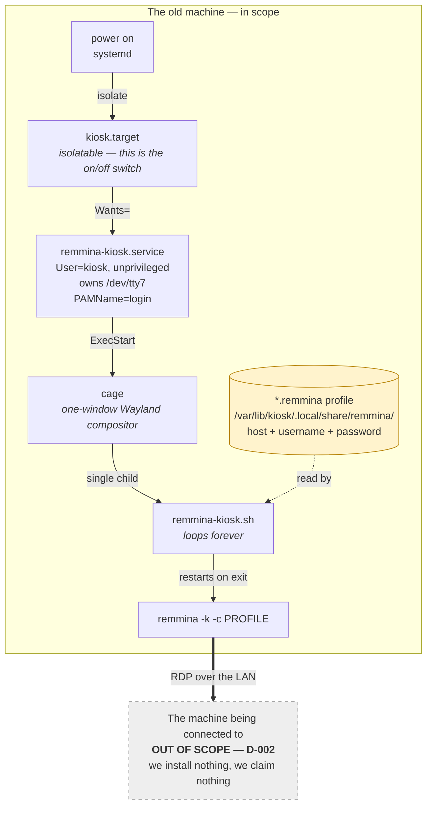

# The system in one page

The product turns an old Linux machine into a terminal that shows nothing but
a remote desktop session. It does this by **adding a boot target** to a machine
that already boots, not by replacing anything.

Everything is built out of parts already present on an apt-family Linux. The
product writes four things onto the machine and owns nothing else.

## The shape

## What each layer is for

| Layer | Job | Which requirement it exists for |
|---|---|---|
| `kiosk.target` | The on/off switch. Isolatable, so activating it tears down the graphical session. | R-4 activation, R-9 root-only, R-11 reversible |
| `remmina-kiosk.service` | Runs the capability as an unprivileged user on its own console, and confines it. | R-15 no privilege, R-16 reach only what it needs, R-10 console stays free |
| `cage` | Gives the client a display with exactly one window and no desktop around it. | R-6 nothing but the remote session |
| `remmina-kiosk.sh` | Finds the connection profile and keeps the client running. | R-8 always returns to the remote login screen |
| the `.remmina` profile | Names the machine to connect to and holds the one credential. | R-5 configuration, R-14 encrypted credential |

## The one sentence that matters

**The screen is given away, the console is not.** `cage` takes `/dev/tty7`, so
the person sitting at the terminal sees only the remote session; the other
virtual consoles and the network stay available to the administrator, which is
how the machine is still reachable and still switchable-off (R-10, R-9).

## Status of this document

Reconstructed from the four prototype files on 2026-09-13 by reading them. The
prototype is **deployed by hand and has never been observed running end to
end**. Nothing in this document is a measurement. See `debt.md`.

The record was opened on that date as a cold start: the product record had been
written over a part-built prototype and explicitly handed the mechanism over,
and nothing at all had been recorded on the engineering side. Every claim in
`docs/architecture/` is therefore a code read of `kiosk.target`,
`remmina-kiosk.service`, `remmina-kiosk.sh` and
`group_rdp_server_server.remmina` — not an observation.
